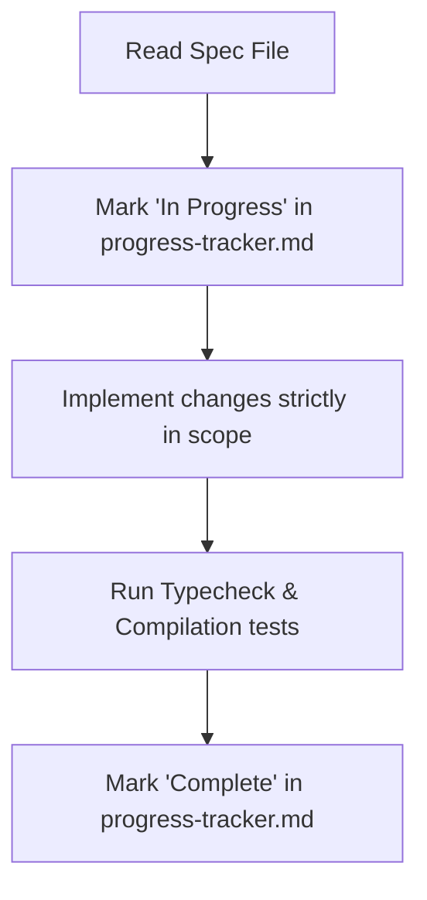

# AI Workflow Rules

This document outlines the strict behavioral standards for any AI agent interacting with this repository. Read and follow these rules exactly during every session.

## Spec-Driven Development

All development tasks must be executed incrementally, utilizing the specifications established in the build plan (`context/specs/00-build-plan.md`). 

* **No Vague Prompting**: Do not implement code based on general conversational directives.
* **One Unit at a time**: Focus entirely on a single defined unit of work. Do not write placeholder code for future phases or implement speculative features.
* **No Side-Edits**: Do not edit files outside the system boundaries defined in the active unit spec.

---

## The Incremental Workflow Cycle

Follow this three-step execution cycle for every feature:

### 1. Initiation
* Read the target spec file `context/specs/NN-[feature-name].md` in full.
* Edit `context/progress-tracker.md` to transition the unit to **In Progress**.

### 2. Implementation
* Execute files and coding additions strictly within the limits defined by the active spec.
* Do not install external NPM dependencies unless explicitly mandated by the spec sheet.

### 3. Verification & Verification Checklist
Before declaring any task finished, compile and check the codebase:
* Ensure zero TypeScript type errors by running `npx tsc --noEmit` on the workspace.
* Ensure zero linting failures by running `npm run lint`.
* Ensure the project builds successfully by executing `npm run build` locally.

### 4. Closure
* Update `context/progress-tracker.md`, moving the unit to **Completed** and adding concise session notes for continuity.
