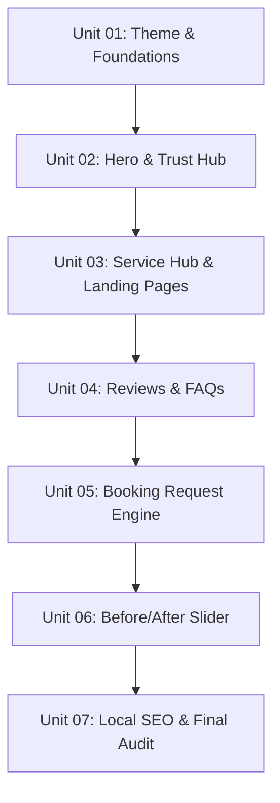

# Build Plan

This master plan breaks down the development of the **Oral and Dental Care Clinic Silchar** website into sequential, single-session units. Each unit produces a concrete, visible, and fully validated result before moving to the next.

---

## The Build Roadmap

---

## Detailed Unit Specifications

### Unit 01: Global Theme & Foundation Layout
* **Goal**: Establish variables, typography, and basic shell layout.
* **Tasks**:
  * Bind custom colors (`plum`, `gold`, `porcelain`, `ink`) as Tailwind v4 variables inside `@theme inline` in `app/globals.css`.
  * Import and configure **Fraunces** and **Inter** self-hosted fonts in `app/layout.tsx`.
  * Build the global responsive Navigation Header (transparent base transitioning to solid Plum on scroll, incorporating a primary Call Now pill CTA).
  * Build the responsive Footer (structured grids containing canonical NAP information, quick service directories, coordinates, and hours).
* **Dependencies**: None.

### Unit 02: Hero Section & Core Trust Indicators
* **Goal**: Build the flagship above-the-fold interface and primary social moats.
* **Tasks**:
  * Build the Hero component featuring bold editorial serif typography, Dr. Devarati BDS bio credentials, and action triggers.
  * Integrate Framer Motion animations for staggered text reveals and decorative solid borders.
  * Render the floating rating badge ("4.9 ★ · 248 reviews") and responsive Trust Strip (visual counter statistics for years of service, patients treated, and hygiene standards).
* **Dependencies**: Unit 01.

### Unit 03: Services Hub & Detail Layouts
* **Goal**: Develop the procedure indexing and SEO-rich service landing pages.
* **Tasks**:
  * Build a static TS definition mapping services details (Preventive, RCT, Surgical, Prosthetics, Veneers, Kids) with HSL colored badges and Lucide React icons.
  * Render a staggered responsive service grid on the homepage linking to descriptions.
  * Build a clean reusable layout format for specific treatment detail landing pages (describing procedures, duration, and patient comfort pointers).
* **Dependencies**: Unit 02.

### Unit 04: Patient Review Wall & FAQ Accordions
* **Goal**: Integrate user-vetted social proof and comprehensive informational accordions.
* **Tasks**:
  * Develop a touch-responsive testimonial review carousel showcasing curated Google reviews and review-entry prompts.
  * Build an dynamic FAQ accordion component using Radix UI/Shadcn primitives, structured for deep JSON-LD compatibility (handling standard inquiries on treatment costs, scheduling, insurance, and UPI payment options).
* **Dependencies**: Unit 03.

### Unit 05: Booking Request Engine
* **Goal**: Create the core conversion tool backing form requests.
* **Tasks**:
  * Build the public-facing Appointment Request Form utilizing unified input styling (rounded borders, gold focus indicators).
  * Connect form inputs to a robust Next.js Server Action validated via a Zod schema.
  * Implement frontend state indicators: loading spinner overlays, input disabling during submit, and clear error banners.
  * Design a custom Success State screen providing explicit "we will contact you" wording and instant WhatsApp quick-link triggers as backup.
* **Dependencies**: Unit 01, Unit 02.

### Unit 06: Before/After Interactive Gallery
* **Goal**: Launch the cosmetic result showcasing slider.
* **Tasks**:
  * Build a highly interactive draggable before/after slider utilizing Framer Motion gestures (`drag="x"`).
  * Wrap the gallery in clear patient-consent warning notes and lightweight layout grids.
* **Dependencies**: Unit 02.

### Unit 07: Local SEO, Schema Injections & Final Auditing
* **Goal**: Perform local search indexing integrations and total typechecks.
* **Tasks**:
  * Integrate standard dynamic JSON-LD scripts (`Dentist`, `MedicalProcedure`, `FAQPage`, etc.) matching canonical clinic NAP details.
  * Confirm unique meta tags for every route and submit functional sitemap matrices.
  * Execute a complete type-check (`npx tsc --noEmit`), lint check, and local build verification (`npm run build`).
* **Dependencies**: All preceding Units.
